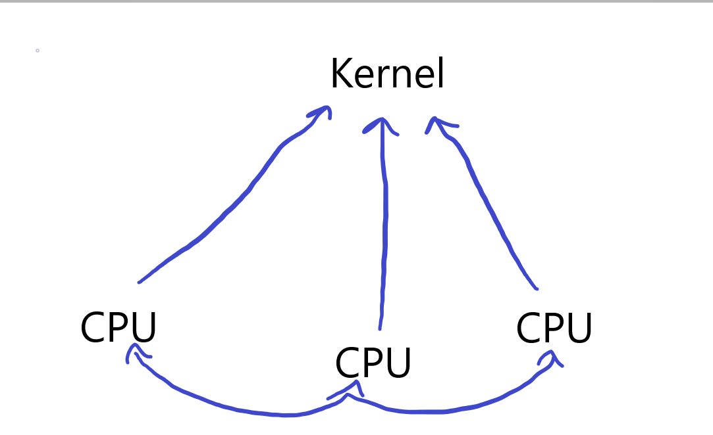

# Scheduling

There exists a pre-processor scheduling server that utilises a circular queue within shared memory for object passing between the kernel and the user-space scheduler. The kernel manages brute context switching, while the user-space scheduler handles scheduling among various contexts with differing priorities. When the kernel depletes this queue, it shall reschedule to the pre-processor scheduling server which will then refill this queue and yield.



The approach for exchanging information between scheduling servers and allocating contexts for governance by a specific core has yet to be decided. Likely the final scheme will involve a combination of notifications for required RPC and direct shared memory for data exchange.

# Memory Portals

```c
struct portal_req {
    int type;
    int prot;
    int length;

    struct __attribute__((packed)) {
        const char *identifier;
        int type;
        int create;
    } share;

    struct {
        const char *name;
        const char *message;
    } sp_req_chain;

    struct __attribute__((packed)) {
        uintptr_t addr;
        size_t length;
        uint64_t paddr[];
    } morphology;
} __attribute__((packed));
```

### Class

Often certain portal classifications are only accessible by special categories of server. A memory portal may belong to many such classifications and combinations of:

- **Share**: Establishes a region of shared memory between servers used for special types of protected IPC.
- **Direct**: Is used to create a direct map for a specified region in physical memory, mainly used for mapping MMIO.
- **Anon**: Creates an anonymous mapping of a specified size.
- **Cow**: A set of frames and references to be fulfilled in accordance with the principles of CoW (Copy on Write).
- **Special**: A special mapping for whose contents must be inferred from a specified chain of servers once written to or read from.

To resolve a page fault pertaining to a special page, the running thread must be blocked, and upon the response, the server is unblocked.

These are all special operations that require special permissions to invoke.

### Trivial Share-Point

Shared memory for object passing can be extremely powerful when paired with the right protocols and interfaces to reduce complexity.

Certain applications require less safety and assurance than others. For example, a unidirectional queue from user-space to kernel-space requires minimal safe-guard. Another common application is shared metadata between multiple instances of the same server, requiring only locking. These basic applications are all that is required for the multi-server scheduling interface to function.

- In these scenarios, it is both the client’s and server’s responsibility to understand the nature of the data passed over shared memory. FAYT will provide macros and wrappers for data access to ensure locking.

- There will exist a table of shared memory portals, maintained in kernel space, each with an identifier, a list of the captured threads, and a pointer to the physical memory of the shared object. Each thread, in effect, manages its own virtual address space, so it will decide where it wants the share-point to be established.

- To create a share-point, you will call the portal system call, passing both the ANON (or DIRECT) and SHARE flags. You will provide a name identifying the share-point and pass a proper morphology. Then the caller will populate it with the share objects. Among any share-point, the first bytes will always be a meta-structure understood by all parties to be a governing object used for synchronization, defined as:

    ```c
    struct [[gnu::packed]] {
        char lock;
        int prot;
        size_t length;
        struct {
            size_t length;
            uint64_t paddr[];
        } morphology;
    };
    ```

- The share-point begins at the next 16-byte aligned address following this meta-structure. All access to the share-point will be understood to only be accessed by a set of wrappers that ensure all locking, protection, and boundary conditions are respected.

- More advanced applications, such as bidirectional queues between servers, will require validation akin to that of Unix domain sockets. A rigorous connection between client and server must be established and maintained. For something like this, which would involve frequent blocking, a capability that can only be provided by an advanced set of schedulers. So, I will dive deeper into this design later.

### Advanced Share-Point

TBD

# Notifications

Sending quick bursts of information between servers, or between a server and kernel-space, can be done via a notification. Which can be invoked with a flag that provides immediate rescheduling. And another flag often used in conjunction with the previous flag, that upon the return of the notifcation handler the system shall immediately reschedule back to the calling context. While this protocol has minimal-overhead, it should be used conservatively. Mostly intended for applications where objects passed between servers occour at a low to moderate frequency and are of high-impact. For applications that require high-frequency object passing it is recommended to use a more robust interface.

Each context contains a possible 64 notificaiton handlers, each with a circumstantially defined use-case. I do not prescribe any pre-defined use-case for any given notification index, as it is understood that each party involved in the notification, understands how that server defines its notification-set. We provide a system call available to core servers that allows the server to provide handlers for any given notification index.

```c
struct [[gnu::packed]] NotificationAction {
    void (*handler)(void*,int,int);
};
```

Notifications will be distributed onto a context by the `notification_dispatch(struct context*)` function. Within `struct context` exists a set of field pertaining to notifcations, such as the a set of actions array and a queue, and most importantly `ucontext`. When a notification is dispatched, the state of context will be saved to `ucontext`, with the state of the current thread being overridden with a fresh notification state. When a notification is complete, the handler will invoke the `notification_ret` syscall. Which restores the previous state of the context in conjunction with `ucontext`.

Each notification receives a fresh stack, but since the kernel has minimal authority over a threads address space, a problem arises when you wish to handle n-number of nested notifcations. A solution would be to provide user-space a syscall to allocate a notification stack, as well as a syscall to provide a notification action that shall be invoked by the kernel whenever it requires a stack to handle an additional nested notification. This is a fringe use-case, but one that should be handled nonetheless. 

A notification handler will exist like this. Where NotificationInfo provides information about the sender and the nature of the call, the data parameter is a region allocated in shared memory for object passing. Notifications provide granular input over-shared memory, and granular output over-shared memory, intended such that a caller will supply the notification invocation with some set of objects, and the notification shall return a set of objects as well.  

```c
void notification(fayt::NotificationInfo *info, void *data, int not) {
  fayt::syscall(NOTIFICATION_RETURN);
}
```

it must exist over shared memory because this has to be generic, it can not be limited to what can only be passed over registers, because potentially a notification will return a large set of objects such as a device enumeration server returning all known devices on the system
