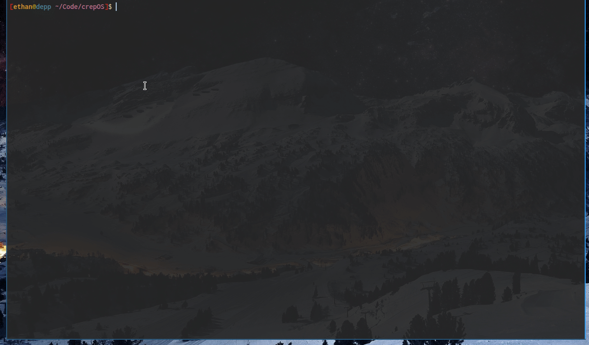

# crepOS

This is a simple operating system made for fun and learning

## About

  This project takes pride in pure simplicity. This project exists as a means for fun, directly poking around hardware with     software is the definition of joy. This OS is amateur, however, here are some of the features we do include:
  
  - Interrupts so we got that keyboard
  
  - Basic mm with identity paging and a pmm
  
  - A basic shell with simple commands
  
  - Malloc & Free and panic
  
  This OS is only around 2 weeks old and all of the features that we currently support will be 100% improved upon and more
  
  Here are some project aspirations:
  
  - Long mode
  
  - Multi-processing and multi-threading
  
  - Process scheduler
  
  - Virtual address spaces for individual programs
  
  - GUI
 
## Build

  This project uses a cross compiler, for obvious reasons this is required. Since this OS is 32 bit, we use the `i686-elf` 
  variant of cross compilers. To setup this cross compiler, simply just run the `Tools/cross.sh` script. However, if you
  are feeling dangerous and dont want to wait the compile time, just edit the Makefile and change the compiler options
  and flags.

  To setup the cross compiler on Linux, you will need a few dependencies, some but not all include: mtools, xorriso, grub,
  qemu, etc

  During the build, if you find yourself getting a `Command not found` error, just put the error into google, and install
  the dependency. Its fairly easy to find missing dependencies.

  Remember, every terminal that you want to compile the operating system in, you have to first set a few basic prefixes
  first: 
  
      export PREFIX="$HOME/opt/cross"
      export TARGET=i686-elf
      export PATH="$PREFIX/bin:$PATH
      
 Then After everything is setup just simply run `make qemu` to build and run the OS
 
 (If you have already sorted out a compiler and dont need to run the `Tools/cross.sh` script then create the Bin directory
 If its not already created)
